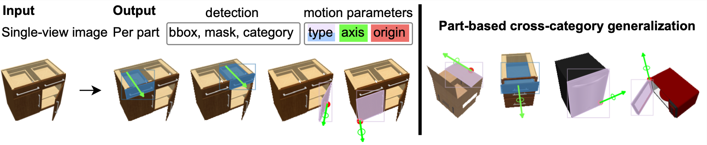

# OPD: Single-view 3D Openable Part Detection

## Overview 
This repository contains the implementation of **OPDRCNN**, a neural architecture that detects openable parts and predicts their motion parameters from a single-view image. The code is developed based on [Detectron2](https://github.com/facebookresearch/detectron2).
<p align="center"></p>

[Paper](https://arxiv.org/pdf/2203.16421.pdf)&nbsp; [Website](https://3dlg-hcvc.github.io/OPD/)

## Content
- [Additional Repo](Additional-Repo)
- [Setup](#Setup)
- [Dataset](#Dataset)
- [Pretrained Models](#Pretrained-Models)
- [Training](#Training)
- [Evaluation](#Eveluation)
- [Visualization](#Visualization)

## Additional-Repo

- ANCSH: We reimplement the ANCSH method using PyTorch for the paper "Category-Level Articulated Object Pose Estimation". For details, check the [ANCSH-pytorch](https://github.com/3dlg-hcvc/ANCSH-pytorch) repo.

- OPDPN: We implement the OPDPN baseline (proposed in this paper). For details, check the [OPDPN](https://github.com/3dlg-hcvc/OPDPN) repo.

## Setup
The implementation has been tested on Ubuntu 20.04, with PyTorch 1.7.1, CUDA 11 and CUDNN 8.0.3.

* Clone the repository
```sh
git clone git@github.com:3dlg-hcvc/OPD.git
```
* Setup python environment
```sh
conda create -n opd python=3.7 
conda activate opd  
pip install -r requirements.txt
```

## Dataset
You can download our `[OPDSynth]` (MotionDataset_h5_6.11) and `[OPDReal]` (MotionDataset_h5_real) [datasets](https://aspis.cmpt.sfu.ca/projects/motionnet/opd/dataset/OPD/dataset.tar.gz) to **./dataset** folder (there is one dataset.tar.gz under /dataset/OPD).

## Pretrained-Models
You can download our pretrained [models](https://aspis.cmpt.sfu.ca/projects/motionnet/opd/models/OPD/models.tar.gz) to **./models** folder (there is one models.tar.gz under /models/OPD).

Models for OPDSynth start with `Synth`, for OPDReal start with `Real`

`[OPDRCNN-O RGB]`&nbsp;&nbsp;&nbsp;&nbsp;&nbsp;`[OPDRCNN-O Depth]`&nbsp;&nbsp;&nbsp;&nbsp;&nbsp;`[OPDRCNN-O RGBD]`

`[OPDRCNN-C RGB]`&nbsp;&nbsp;&nbsp;&nbsp;&nbsp;`[OPDRCNN-C Depth]`&nbsp;&nbsp;&nbsp;&nbsp;&nbsp;`[OPDRCNN-C RGBD]`

## Training
To train from the scratch, you can use below commands. The output will include evaluation results on the val set.

* Train the only_det model (only train the detection and segmentation) -> only det model has no difference for OPDRCNN-O or -C.
  ```sh
  python train.py \
  --config-file configs/bmcc.yaml \
  --output-dir train_output \
  --data-path <PATH_TO_DATASET> \
  --input-format <RGB/depth/RGBD> \
  --model_attr_path <PATH_TO_ATTR> \
  --only_det 
  --opts SOLVER.BASE_LR 0.005 SOLVER.MAX_ITER 30000 SOLVER.STEPS '(18000.0, 24000.0)' SOLVER.CHECKPOINT_PERIOD 5000 
  ```
  * Dataset:
    * OPDSynth:
      
      * --data-path `dataset/MotionDataset_h5_6.11`
      * --model_attr_path `dataset/MotionDataset_h5_6.11/urdf-attr.json`
* Pick the best only detections model for different inputs `RGB/depth/RGBD`
* Continue training the full models with the best only detection models
  ```sh
  python train.py \
  --config-file <MODEL_CONFIG> \
  --output-dir train_output \
  --data-path <PATH_TO_DATASET> \
  --input-format <RGB/depth/RGBD> \
  --model_attr_path <PATH_TO_ATTR> \
  --extrinsic_weight 15 \
  --motion_weights 1 8 8 \
  --opts MODEL.WEIGHTS <PPRETRAINED_MODEL> SOLVER.BASE_LR 0.001 SOLVER.MAX_ITER 60000 SOLVER.STEPS '(36000, 48000)' SOLVER.CHECKPOINT_PERIOD 5000
  ```
  * Model:
    * OPDRCNN-O: 
      * --config-file `configs/bmoc_v0.yaml`
    * OPDRCNN-C:
      * --config-file `configs/bmcc.yaml`
  
  * Dataset:
    * OPDSynth: 
      * The same to above
      * MODEL.WEIGHTS <BEST_ONLY_DET_MODEL>
    * OPDReal:
      * --data-path `dataset/MotionDataset_h5_real`
      * --model_attr_path `dataset/MotionDataset_h5_real/real-attr.json`
      * additional --opts (Add thie after 5000): ` MODEL.PIXEL_MEAN '[144.7425400388733, 131.67830996768458, 113.38040344244014, 975.0775146484375]' MODEL.PIXEL_STD '[20.100716763269578, 20.805474870130748, 23.863171739073888, 291.606201171875]'`
      * MODEL.WEIGHTS <PRETRAIN_OPDSynth_MODEL>
      * PS: the LR for depth data is 0.0001 instead of 0.001 (the same to the paper describes)
## Evaluation
Evaluate with pretrained model, or your own trained model on val set

```sh
python evaluate_on_log.py \
--config-file <MODEL_CONFIG> \
--output-dir eval_output \
--data-path <PATH_TO_DATASET> \
--input-format <RGB/depth/RGBD> \
--model_attr_path <PATH_TO_ATTR> \
--opts MODEL.WEIGHTS <PPRETRAINED_MODEL>
```

* Dataset needs the same options as above
* Model needs the same options as above
* Evaluate on test set: add things to `--opts DATASETS.TEST "('MotionNet_test',)"` (The complete version will be `--opts MODEL.WEIGHTS <PPRETRAINED_MODEL> DATASETS.TEST "('MotionNet_test',)"`)
* Use inference result file instead of pretrained model: --inference-file `<PATH_TO_INFERENCE_FILE>`, this will directly evaluate using the results without inferencing again

## Visualization
(Current code version need to download the [dataset]() in raw format for visualization)
* Visualize the GT with 1000 random images in val set 
  ```sh
  python render_gt.py \
  --output-dir vis_output \
  --data-path <PATH_TO_DATASET> \
  --valid-image <IMAGE_LIST_FILE> \
  ```
  * Dataset:
    * OPDSynth: 
      * --data-path `dataset/vis/MotionDataset_6.11`
      * --valid-image `dataset/vis/MotionDataset_6.11/val_1000.json`
    * OPDReal:
      * --data-path `dataset/vis/MotionDataset_real`
      * --model_attr_path `dataset/vis/MotionDataset_real/real-val_1000.json`
      * --is-real

* Visualize the PREDICTION with 1000 random images in val set
  ```sh
  python render_pred.py \
  --output-dir vis_output \
  --data-path <PATH_TO_DATASET> \
  --model_attr_path <PATH_TO_ATTR> \
  --valid-image <IMAGE_LIST_FILE> \
  --inference-file <PATH_TO_INFERENCE_FILE> \
  --score-threshold 0.8 \
  --update-all 
  ```
  * Dataset:
    * OPDSynth: the same to above
    * OPDReal: the same to above
  * PS: inference file can be got after doing the evaluation 
